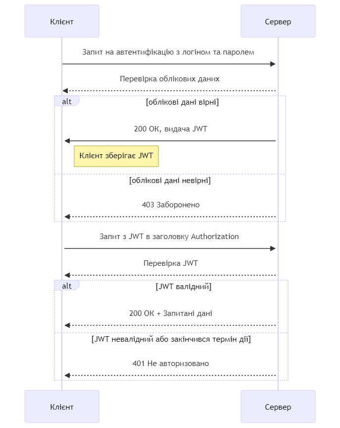

# Bachelor HTTP Token Auth
Repository contains code of HTTP Token Authentication for my Dyplom Bakalavra (Diploma/ qualification of Bachelor)

|             | Information                    | 
| --------    | --------                       |
| Name        | JSON Web Token                 |
| Standard    | RFC 7519                       |
| Description | This method uses tokens to authenticate users instead of cookies. The user authenticates using valid credentials and the server returns a signed token. This token can be used for subsequent requests.   |

#### Diagram:
